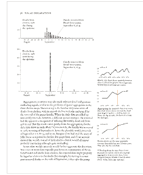

# History

Doodl was inspired by the
[glasseye package](http://coppeliamla.github.io/glasseye)
written by Simon Raper at CoppeliaMLA. Like glasseye,
doodl brings together three things:

1. The markdown markup language (and, in particular, the
   [pandoc](https://pandoc.org/) extensions to markdown)
2. The
   [Tufte wide margin layout](https://github.com/daveliepmann/tufte-css)
   11. The Tufte layout makes
   extensive use of a wide margin to display notes, images and
   charts. 
3. Data visualization using [d3](http://d3js.org)

The original version was groundbreaking when it was written in 2015,
but it was essentially a personal project that Raper kindly made available
to others as a courtesy. It was not intended to be a generally usable tool.
Our version differs from the original in the following ways:

1. We have upgraded the version of Python from the original 2.7 to 3.12.
2. We have upgraded the version of d3 from version 6 to version 7.9.0
    (the latest stable version).
3. As a result of upgrading d3, all of the chart implementations have been
   almost completely rewritten.
4. We have changed the build implementation to use `make`, and have
   removed any dependencies or references to hard coded personal
   folder names.
5. We have added a number of new chart types that were not in the
   original version.
6. The generated Javascript bundles are now referenced from CDNs
   instead of locally.
7. We have added the ability to add many, many other sources of
   visualizations using
   [Laurent P. René de Cotret](https://laurentrdc.xyz/)'s
   [Pandoc-Plot](https://github.com/LaurentRDC/pandoc-plot) package
8. The package now consists of a python script (what you get when you
   type "doodl" on the command line), and three remotely hosted
   files (two CSS and one Javascript).
9. We have also made it possible to use custom charts, implemented
   outside of doodl.

The result is that making and formatting a new document is now just a
matter of installing doodl, creating a new markdown document, and
running doodl on the document, which creates an equivalent HTML
document (possibly including image files in a `plots` folder,
generated by Pandoc-Plot).
